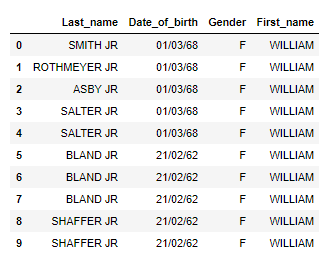
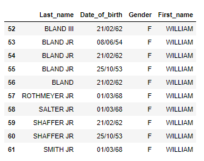

# HackerCamp-Summer-2018-Submission---Analytics-

Hi!! I am **Kartikeya Chouhan**, B.Tech undergraduate from IIT Roorkee.    
I am more familier with working on jupyter notebooks so I have also pushed the .ipynb file.  
I have written the follwing code in order the solve the **Analytics Assignment** for Innovaccer Summer Internship for 2018.

---
**Importing the necessary Libraries**
```
import numpy as np
import pandas as pd
```
---
**reading the csv file**
```
headings  = ['Last_name', 'Date_of_birth', 'Gender', 'First_name']
def load_data():
    data = pd.read_csv('D:/ML/Deduplication Problem - Sample Dataset.csv', names = headings, skiprows = 1)
    return data

data = load_data()
data.head(10)
```
The above code shows the sample input dataset that we will pass to the model. Initially the dataset contains **103 rows**.     
The first ten rows of the input dataset is shown below:    
  
As you can see there are duplications of names such as, WILLIAM SHAFFER JR, WILLIAN BLAND JR, etc.

---
**Defining a fuction to sort and remove dupicate names through dictionary**  
Below is the fuction to add the unique value of names from the dataframe to a dictionary with the help of new column.     
This new column contains all the information to uniquely identify a name.  
```
def sort_remove(data):
    
    # adding a new colums to sort and remove duplicate
    data['Full_name'] = data['First_name'] + data['Last_name'] + data['Date_of_birth']
    
    output = {}
    
    # using the new column as key to form the dictionary with the
    # values of original dataset
    
    for i in range(0, 103):
        
        a = data.loc[i]
        
        key = a[4]
        value = np.array(a[0:4])
        
        if key not in output:
            output[key] = []
            output[key].append(value)
    
    # getting the dataframe out of the dictionary
    uni = pd.DataFrame(output).transpose()
    
    j = 0
    for k in headings:
        uni[k] = [uni.iloc[i,0][j] for i in range(0,62)]
        j += 1

    del uni[0]
    
    uni.index = range(62)
    
    return uni

# calling the sort_remove function
uni = sort_remove(data)
uni.tail(10)
```
The above function returns a new dataset having **62 rows** consisting the unique names without any duplication. There is no repetition of same date of birth in the case of totally same names.       
Here is the sample output:   
  
The above image is showing last 10 rows out of the 62 rows as the names have been arranged in an alphabetical order according to the First_name.  

---
**Major Bug and solution**
First I tried to sort via lists then I found that list was unhashable type and it was difficult  converting it into Dataframe.  
Then, I tried using dictionary for the same and it worked well.
